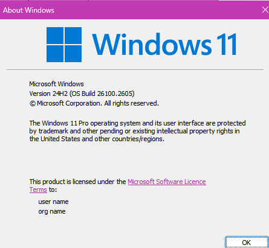
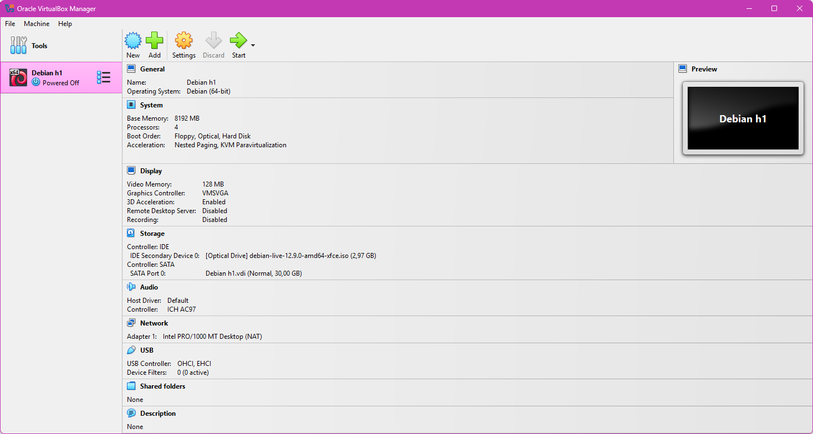

<H1>h1 Oma Linux</H1>
<h2>Raportin  kirjoittaminen</h2>  

-Kirjoita jokainen vaihe työssäsi ylös   

-Jos joku muu lukee raportin, jokaisen pitää pystyä toistamaan raportin pohjalta esimerkiksi vastaan tulleet ongelmat   

-Älä vain tee vaan kirjaa jatkuvasti kaikki komennot ylös kellonaikoineen  

-Tee raporteista selkeä; käytä väliotsikoita ja kappaleita  

-Käytä imperfektiä raporteissa   

<h2>Free software foundation -periaatteet</h2>  

<b>-Vapaus 0:</b> Vapaus suorittaa ohjelmaa haluamallasi tavalla ja mihin tarkoitukseen haluat   

<b>-Vapaus 1:</b> Vapaus tutkia miten ohjelma toimii, ja muokata sitä omiin tarpeisiin. Lähdekoodin tulee olla siis saatavilla.  

<b>-Vapaus 2:</b> Vapaus levittää kopioita ohjelmasta jotta voit auttaa muita.   

<b>-Vapaus 3:</b> Vapaus levittää muokattuja versioita muille. Näin ollen voit antaa koko yhteisölle mahdollisuuden hyötyö tekemistäsi muutoksista. Lähdekoodin tulee olla saatavilla.   

 
<H3>Linuxin asentaminen virtuaalisesti</H3>   

<h4>Rauta</h4>  

    -Prosessori 7800x3D (8 ydintä, 16 säijettä)
    -RAM 64Gb (6000 Mt/s)
    -GPU Nvidia RTX 4090 (Ajuriversio 566.36)
    -NVMe 3 Tb  
 
    
    
    
 

<H4>Virtuaalikoneen tiedot ja versiot</H4>  

    -Käytin Virtualbox versiota 7.1.4 r165100 (Qt6.5.3)  
    -Asennetttuna oli myös Oracle Virtualbox Extension Pack ver. 7.1.4r165100  
    -Asennusmediana oli debian-live-12.9.0-amd64-xfce.iso jonka mounttasin optical diskiksi  
    -Annoin virtuaalikoneelle 4 ydintä  
    -Annoin virtuaalikoneelle 8Gb RAM:ia  
    -Annoin virtuaalikoneelle 30 Gb kiintolevytilaa  
    -Annoin virtuaalikoneelle videomuistia 128MB ja laitoin päälle 3d kiihdytyksen
    -Annoin virtuaalikoneelle nimeksi Debian h1

 

   
 
 <H3>Virtuaalikoneen käynnistys</H3>  
<pre> 
 -Kun olin säätänyt asetukset kuntoon käynnistin virtuaalikoneen painamalla Start näppäintä.  
 -Avautui boot menu josta valitsin Live system (amd64)  
 -
