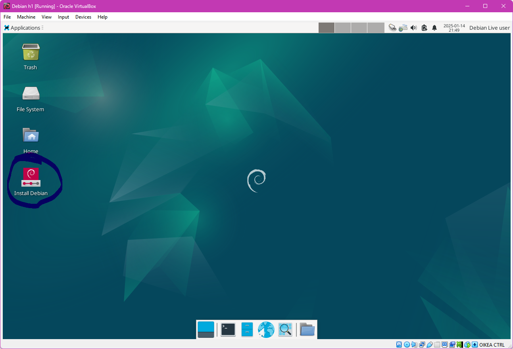
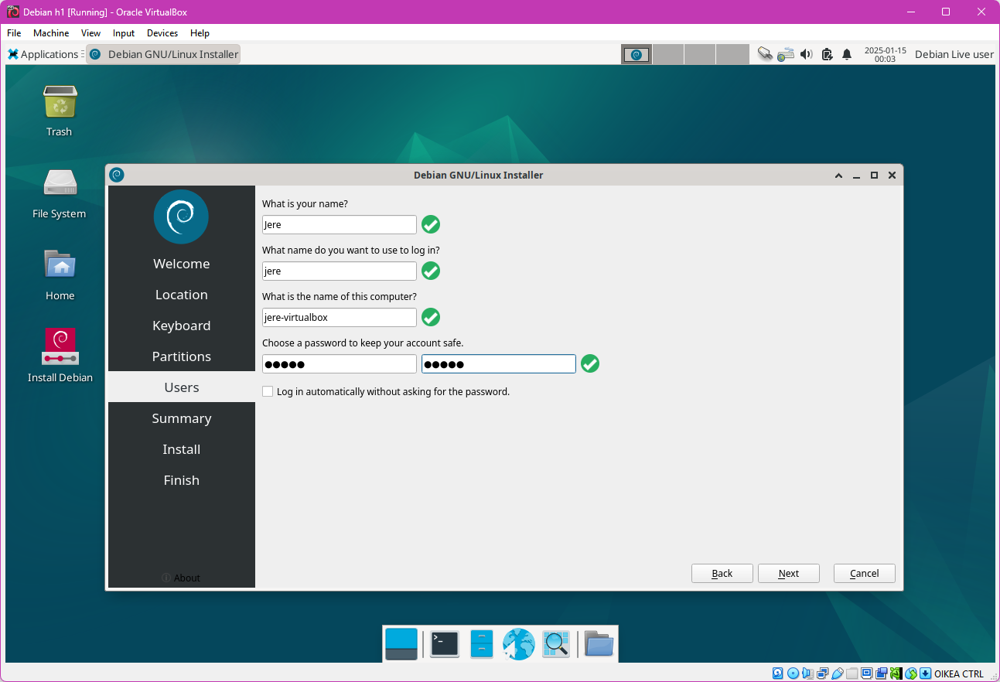
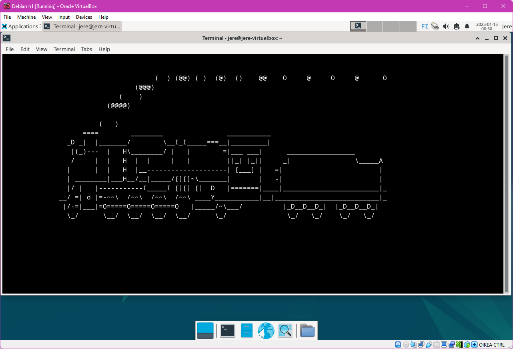

<H1>h1 Oma Linux Jere Pellinen</H1>
<h2>Raportin  kirjoittaminen</h2>  

-Kirjoita jokainen vaihe työssäsi ylös   

-Jos joku muu lukee raportin, jokaisen pitää pystyä toistamaan raportin pohjalta esimerkiksi vastaan tulleet ongelmat   

-Älä vain tee vaan kirjaa jatkuvasti kaikki komennot ylös kellonaikoineen  

-Tee raporteista selkeä; käytä väliotsikoita ja kappaleita  

-Käytä imperfektiä raporteissa   

<h2>Free software foundation -periaatteet</h2>  

<b>-Vapaus 0:</b> Vapaus suorittaa ohjelmaa haluamallasi tavalla ja mihin tarkoitukseen haluat   

<b>-Vapaus 1:</b> Vapaus tutkia miten ohjelma toimii, ja muokata sitä omiin tarpeisiin. Lähdekoodin tulee olla siis saatavilla.  

<b>-Vapaus 2:</b> Vapaus levittää kopioita ohjelmasta jotta voit auttaa muita.   

<b>-Vapaus 3:</b> Vapaus levittää muokattuja versioita muille. Näin ollen voit antaa koko yhteisölle mahdollisuuden hyötyö tekemistäsi muutoksista. Lähdekoodin tulee olla saatavilla.   

 
<H3>Linuxin asentaminen virtuaalisesti</H3>   

<h4>Rauta</h4>  

    -Prosessori 7800x3D (8 ydintä, 16 säiettä)
    -RAM 64Gb (6000 Mt/s)
    -GPU Nvidia RTX 4090 (Ajuriversio 566.36)
    -NVMe 3 Tb  
 
    
    
    
 
  <b>Aika: 0:00</b> 
<H4>Virtuaalikoneen tiedot ja versiot</H4>  

   
    -Käytin Virtualbox versiota 7.1.4 r165100 (Qt6.5.3)  
    -Asennetttuna oli myös Oracle Virtualbox Extension Pack ver. 7.1.4r165100  
    -Asennusmediana oli debian-live-12.9.0-amd64-xfce.iso jonka mounttasin optical diskiksi  
    -Annoin virtuaalikoneelle 4 ydintä  
    -Annoin virtuaalikoneelle 8Gb RAM:ia  
    -Annoin virtuaalikoneelle 30 Gb kiintolevytilaa  
    -Annoin virtuaalikoneelle videomuistia 128MB ja laitoin päälle 3d kiihdytyksen
    -Annoin virtuaalikoneelle nimeksi Debian h1  
   <b>Aika: 0:09</b> 

 

   
 
 <H3>Virtuaalikoneen käynnistys</H3>  
<pre> 
<b>Aika: 0:09</b>  
-Kun olin säätänyt asetukset kuntoon käynnistin virtuaalikoneen painamalla Start näppäintä.  
-Avautui boot menu josta valitsin Live system (amd64)  
-Hetken päästä avautui työpöytä jossa tuplaklikkasin "Install Debian"  
<b>Aika: 0:13</b> 
</pre>  

  
<pre>  
<b>Aika: 0:14</b> 
-Asennusohjelma avautui, jätin kielen oletusarvoksi eli American English (United States) ja painoin next  
-Seuraavassa laitoin oikean aikavyöhykkeen, siis Suomen, Helsingin, jossa olen tällä hetkellä ja painoin sitten next  
-Seuraavaksi valitsin näppäimistöasettelun "Finnish" ja painoin next  
-Seuraavassa ruudussa joka koski partitioita valitsin "Erase Disk" ja painoin next  
-Seuraavassa ikkunassa kysyttiin nimeäni, käyttäjänimeäni, tietokoneen nimeä sekä salasanaa. Salasana tuli myös toistaa. Painoin jälleen next.  
<b>Aika: 0:29</b> 
    
</pre>  

  

<pre>  
<b>Aika: 0:30</b> 
-Asennusohjelma näytti koosteen valinnoistani, jotka vaikuttivat oikeilta. Painoin Install.   
-7 minuutin päästä asennusohjelma oli valmis ja halusi käynnistää itsensä uudestaan. Painoin Done.  
-Kone käynnistyi uudelleen ja kysyi käyttäjänimeä ja salasanaa jotka laitoin ja painoin Log In  
-Avasin konsolin ja kirjoitin seuraavat käskyt. Sudoa käytettäessä laitetaan salasana.
<b>Aika: 0:44</b> 
</pre>  

<h4>Terminaali</h4>

<pre>
sudo apt update

sudo apt upgrade

sudo apt install sl  
    
sl
</pre>  

<b>Aikaa meni yhteensä 1:10</b>  

<h2>Juna</h2>

  

<h2>Lähteet</h2>  
<pre>
-http://terokarvinen.com/2006/raportin-kirjoittaminen-4  
    Tehtävä x) käytetty pohjana raportin kirjoittamistehtävän pohjana  
-https://www.gnu.org/philosophy/free-sw.html  
    Tehtävä x) Käytetty pohjana ymmärryksen kasvattamisessa free softwaren suhteen ja open sourcen
-Kurssi Linux-palvelimet - ICI003AS2A-3008 - 2025p1 - ti 1740 online - Tero  
    Moodlesta löytyi linkkejä alla oleviin
-https://terokarvinen.com/linux-palvelimet/  
    Tehtävän-anto
-https://itsfoss.com/ubuntu-terminal-train/  
    Käytin hakukonetta löytääkseni tuksuttavan junan josta ainakin luulen Bonuksessa olleen kysymys
-Tätä dokumenttia saa kopioida ja muokata GNU General Public License (versio 2 tai uudempi) mukaisesti. http://www.gnu.org/licenses/gpl.html
-Pohjana Tero Karvinen 2012: Linux kurssi, http://terokarvinen.com </pre>

Tekijä: Jere Pellinen, Haaga-Helian ammattikorkeakoulu, Tradenomi, tietojenkäsittely (ei valmistunut vielä)  
Helsinki, 2025
