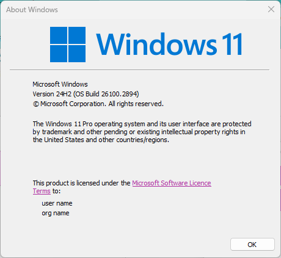
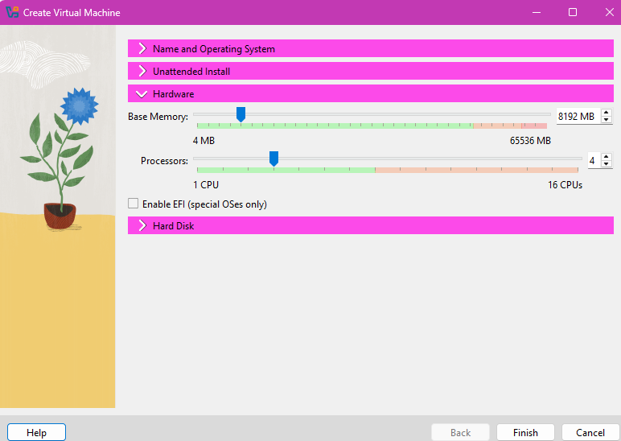
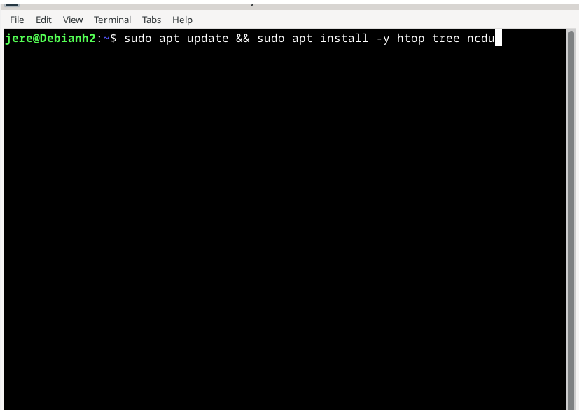
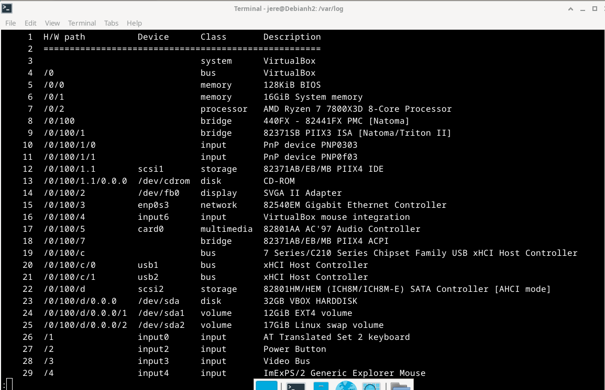
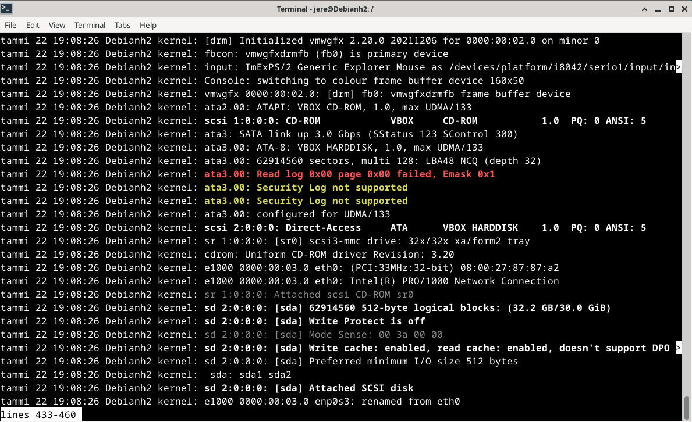
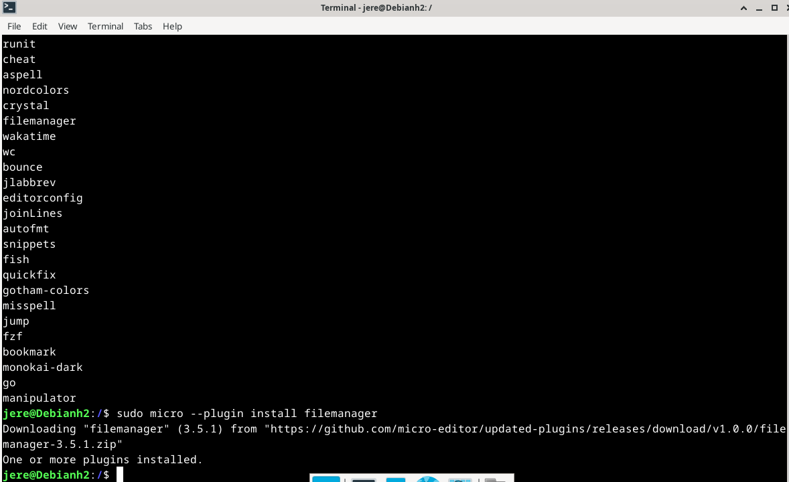

```markdown
## Tehtävä Komentaja Pingviini

### x) Lue ja tiivistä

- Komentorivi on ollut olemassa ennen Googlea, Webbiä, Linuxia, Windowsia ja jopa ennen Internetiä.  
- Nämä komennot ovat peruskomentoja, joita tarvitsee päivittäin, kun on Linuxin kanssa tekemisissä.  
  [Peruskomennot](https://terokarvinen.com/2020/command-line-basics-revisited/?fromSearch=command%20line%20basics%20revisited) on tärkeä painaa mieleen.  
- Tärkeitä kansioita ovat:  
  - `/`  
  - `/home`  
  - `/home/Username/`  
  - `/etc/`  
  - `/media/`  
  - `/var/log/`  
  Niistä löytyy selitykset (englanniksi) edellä mainitusta linkistä.  
- `sudo` on äärimmäisen tärkeä komento ylläpitäjälle tai yksityiskoneelle ohjelmien asennusta ja järjestelmän ylläpitoa varten. Sen avulla voi tehdä kernel-päivityksiä, asentaa ohjelmia yms. Käyttäjän tulisi kuulua `sudo`-ryhmään, jos haluaa näitä oikeuksia.

---

### Rauta



### Virtuaalikoneen tiedot ja versiot



---

### Aika 0:00 – Koneen avaus

- Boottasin koneen painamalla **Start**.
- Hetken päästä OS kysyi käyttäjänimeä ja salasanaa, jotka laitoin.
- Avasin terminaalin ja kirjoitin:

```bash
sudo apt update
sudo apt upgrade
```

ja painoin <kbd>Enter</kbd>.

#### a) Micro

Annoin alla olevan komennon ja painoin enter. (Komennon sisältöä ei ole tarkasti mainittu tekstissä, mutta se voisi olla esimerkiksi:)

```bash
sudo apt update && sudo apt install micro
```

---

### Aika 0:07 – b) Apt

Annoin seuraavan käskyn:

```bash
sudo apt update && sudo apt install -y htop tree ncdu
```

- Se kysyi salasanaa, kirjoitin sen ja painoin enteriä.
- `&&` tekee sen, että jälkimmäinen asennuskomento ajetaan vain, jos ensimmäinen (`apt update`) onnistuu.
- `-y` laittaa automaattisesti **yes** jokaisen kohdan kohdalla.



---

### Aika 0:18 – c) FHS

*(FHS = Filesystem Hierarchy Standard. Ei erillisiä esimerkkejä komennosta annettu.)*

---

### Aika 1:30 – d) The Friendly M ja e) Pipe

`grep` on monipuolinen komento.

Käskyllä:

```bash
grep "virhe" /var/log/syslog
```

`grep` hakee ja listaa rivit, joilta löytyy merkkijono `"virhe"` tiedostosta `syslog`.

Käskyllä:

```bash
grep -r "Kiire" projektit
```

`-r` eli rekursiivinen haku, käy läpi kaikki alihakemistot ja niiden tiedostot annetussa polussa (tässä `projektit`), etsien merkkijonoa `"Kiire"`. Se tulostaa kaikki rivit, joissa hakusana näkyy, sekä niiden tiedostonimet.

#### Putkittaminen ja grep

```bash
ps aux | grep "jere" | nl | less
```

- `ps aux` listaa kaikki käynnissä olevat prosessit.  
- `| grep "jere"` suodattaa niistä ne, joissa lukee `jere`.  
- `| nl` lisää järjestysnumerot listauksen eteen.  
- `| less` näyttää tulosteen sivutettuna, jolloin sitä voi selailla nuolilla tai hiiren rullalla.

---

### Aika 1:46 – f) Rauta

Kirjoitin esimerkiksi:

```bash
sudo lshw -short
```



Tuli listaus laitteista, väylistä, prosessorin tiedoista, kiintolevystä ja sen osioista, muistin määrästä, näytöstä jne. Sarakkeet ovat:
- **H/W path**: laiteväylän osoite (hierarkkinen juuresta alkaen)
- **Device**: laite
- **Class**: laitteen luokka
- **Description**: kuvaus

**HW path** on ikään kuin laiteväylän osoite, jonka kautta kyseinen laite löytyy järjestelmästä. Kaikki lähtee root-väylästä (root-bus). Näin lshw näyttää, miten laite on liitetty käyttöjärjestelmän näkökulmasta.

---

### Aika 2:30 – g)

Käsky:

```bash
journalctl
```

Tämä näyttää tietoja siitä, mitä koneen kerneli tekee ja milloin. Varoitukset ovat keltaisella, virheet punaisella. Täältä näkyy kaikki järjestelmän tapahtumat, selkeämmin ja tarkemmin kuin vaikkapa Windowsin Event Vieweristä.



---

### Aika 3:00 – h) Plugin microniin

Suoritin seuraavat käskyt (esimerkiksi):

```bash
micro -plugin install <plugin_nimi>
```

tai 

```bash
micro -plugin list
```

Pluginien hallinta löytyy myös [micro-editorin](https://micro-editor.github.io/plugins.html) dokumentaatiosta.



---

## Lähteet

- [https://en.wikipedia.org/wiki/Command-line_interface](https://en.wikipedia.org/wiki/Command-line_interface) – Tietoa CLI:stä  
- [https://www.debian.org/doc/manuals/debian-reference/ch02.en.html](https://www.debian.org/doc/manuals/debian-reference/ch02.en.html) – Tietoa komentoriviohjelmista  
- [https://manpages.ubuntu.com/manpages/trusty/man8/apt.8.html](https://manpages.ubuntu.com/manpages/trusty/man8/apt.8.html) – Tietoa aptin käytöstä  
- [https://terokarvinen.com/2020/command-line-basics-revisited/?fromSearch=command%20line%20basics%20revisited](https://terokarvinen.com/2020/command-line-basics-revisited/?fromSearch=command%20line%20basics%20revisited) – Perustiedot, joita tarvittiin myös tehtävään  
- [https://www.geeksforgeeks.org/grep-command-in-unixlinux/](https://www.geeksforgeeks.org/grep-command-in-unixlinux/) – Tietoa `grep`-komennosta  
- [https://www.linux.com/training-tutorials/deep-hardware-discovery-lshw-and-lsusb-linux/](https://www.linux.com/training-tutorials/deep-hardware-discovery-lshw-and-lsusb-linux/) – Opin H/W pathistä  
- [https://micro-editor.github.io/plugins.html](https://micro-editor.github.io/plugins.html) – `micro`-editorin plugarit

---

**Tekijä**: Jere Pellinen, Haaga-Helian ammattikorkeakoulu, Tradenomi, tietojenkäsittely (ei valmistunut vielä)  
**Helsinki, 2025**
```
